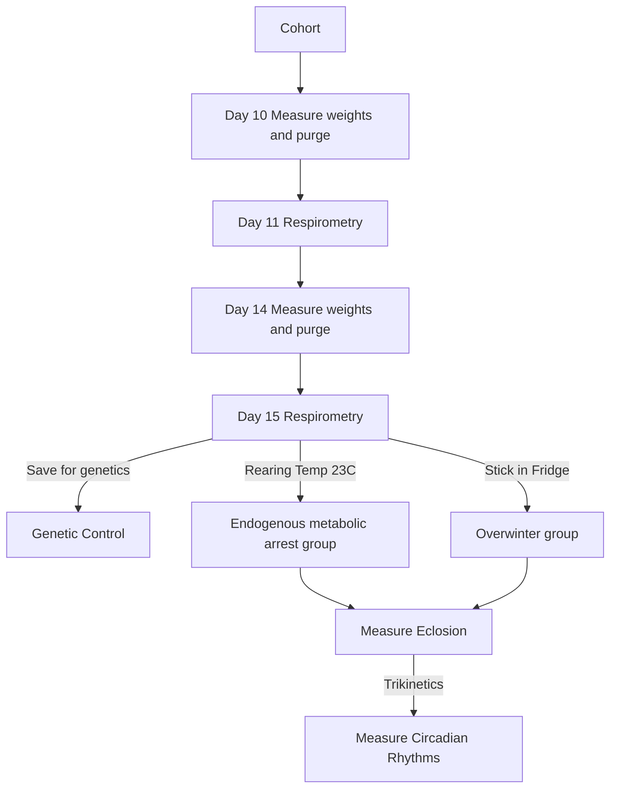

Detailed Experimental workflow

```mermaid
graph TD
A[Cohort]--> B[Day 10 Measure weights and purge]
B--> C[Day 11 Respirometry]
C-->D[Day 14 Measure weights and purge]
D--> E[Day 15 Respirometry]
E--Save for genetics-->G[Genetic Control]
E--Rearing Temp 23C--> H[Endogenous metabolic arrest group]
E--Stick in Fridge-->I[Overwinter group]
H--> V[Measure Eclosion]
I--> V
V--Trikinetics--> P[Measure Circadian Rhythms]


```

