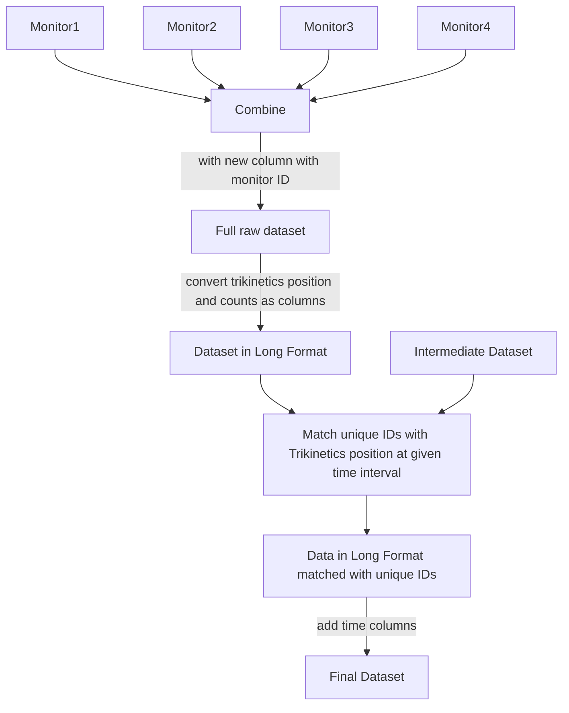

**Objective:** Tranform raw Trikinetics Data into usable dataset for statistical analyses. So we need behavioral counts for each unique individual at the time period they were in the trikinetics rigs for both entrainment and free-run experiments. 

**<u>Initial Dataset(column annotation):</u>** for each monitor (there are 4 so far)  

1. Index at reading (from 1 with each program restart)
2. Date of reading (9 Dec 06)
3. Time of reading (19:09:30)
4. Monitor status (1 = valid data received)
5. Extra readings included in this bin (DAMFileScan outputs only)
6. unused (0)
7. unused (0)
8. unused (0)
9. unused (0)
10. DAM2 Light Status (1 = On, 0 = Off)
11. Channel 1 - activity counts
12. Channel 2

... ...

42. Channel 32

**<u>Intermediate/Linking Dataset</u>**

1. uniqueID
2. eclosion_date: yyyy-mm-dd ; first day of trikinetics entrainment
3. eclosion_days
4. well_id
5. organism : wasp or fly
6. Trikinetics_position: 1-32
7. Trik_monitor: 1-2
8. Trikinetics_entry_LD_time: military time
9. Trikinetic_exit_date: yyyy-mm-dd
10. Trikinetics_exit_LD_time : military time
11. notes_2
12. Free_run_trik_monitor: 3-4
13. Free_run_trik_position: 1-32
14. Free_run_entry_date : yyyy-mm-dd
15. Free_run_entry_time : military time
16. Free_run_exit_date: yyyy-mm-dd
17. Free_run_exit_time: military time

<u>**Final Dataset**</u>

1. unique_ID
2. Date : yyyy-mm-dd
3. Day_Time : military time
4. Experiment: Entrainment or Free Run
5. counts : 0-infinity
6. continuous_timing: 0.1 - end of each experiment; 6 minute bins
7. Experiment_day: 1- 8 Entrainment; 1-8 free run
8. full_continuous: 0.1 - end of experiment (Entrainment to Free run)
9. Day: 1- 16 entrainment to free run

...

<u>General Workflow</u>

